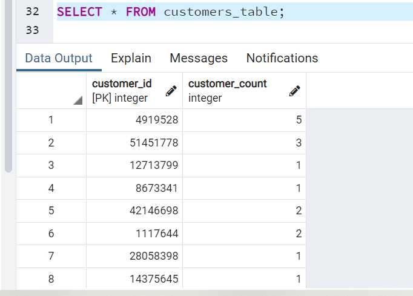

#  Amazon Vine Program Analysis

## **Overview of the analysis**: 

### In the project, we were asked to analyze Amazon reviews written by members of the paid Amazon Vine program, a service that allows manufacturers and publishers to receive reviews for their products. Companies like SellBy pay a small fee to Amazon and provide products to Amazon Vine members, who are then required to publish a review.

### We had acccess to about 50 datasets, and selected to analyze US Health Personal Care dataset. The dataset contained the following information:

* marketplace
* customer_id
* review_id
* product_id
* product_parent
* product_title
* product_category
* star_rating
* helpful_votes
* total_votes
* vine
* verified_purchase
* review_headline
* review_body
* review_date

#### In Deliverable 1, using PySpark, we extracted the dataset, transformed the data, and connected to an AWS RDS instance.

#### We finally loaded the transformed data into pgAdmin by creating 4 different tables. 

#### In Deliverable 2, using PySpark again, we attempted to determine whether there was any bias toward favorable reviews from Vine members in the US Health Personal Care dataset.

## **Results of the Analysis**:

### In order to determine whether there was any bias toward favorable reviews from Vine members, we filtered our whole dataset to only retrieve rows where there were more than 20 total votes, and where the number of helpful votes divided by total votes were higher than 50%. Secondly, we separated the data into 2 final dataframes, one for all Paid reviews in the Vine program, and one for Unpaid reviews outside of the Vine progran. Lastly, the dataframes were also filtered to display 5-star reviews. Statistics were calaculated for each of these dataframes.

1. How many Vine reviews and non-Vine reviews were there?
#### There were a total of **497** Vine reviews in our cleaned up dataset (i.e. at least 20 reviews where  where helpful_votes is equal to or greater than 50% of total votes) while there were a total of **120,863** non-Vine reviews.

2. How many Vine reviews were 5 stars? How many non-Vine reviews were 5 stars?
#### There were a total of **220** five-star Vine reviews in our cleaned up dataset while there were a total of **74,470** five-star non-Vine reviews.

3. What percentage of Vine reviews were 5 stars? What percentage of non-Vine reviews were 5 stars?
#### Five-star Vine reviews represented **44%** of the total Vine reviews (220 divided by 497).

#### Five-star non-Vine reviews represented **62%** of the total non-Vine reviews (74,470 divided by 120,863).

## **Summary of the Analysis**:

### Because the percentage of 5-star reviews in the paid Vine program (44%) was actually **lower** than the percentage of 5-star reviews in the non-paid non-Vine program (62%), we can conclude that at least in our specific dataset, there was no obvious positivity bias for reviews in the Vine program. However, the total number of Vine reviews (497) was so much lower than the total number of non-Vine reviews (120,863) that it is possible we do not have enough reviews in the Vine program yet to understand its performance and efficiency.  

### An additional analysis we could run would be to look at the non-Vine reviews' statistics such as the star_ratings' mean and standard deviation to understand the non-paid reviews distribution by start ratings, and whether those tend to be skewed because of some outliers. 
